<div align="center">


# 🎓 Smart Placement Analytics System

### A production-ready, full-stack college placement management platform
### with role-based dashboards, real-time analytics, and ML-powered predictions

[](https://placement-analytics.onrender.com)
[](https://github.com/govindturkar69-crypto/Placement-Analytics)


</div>

---

## 📸 Screenshots

<div align="center">

### Login Page
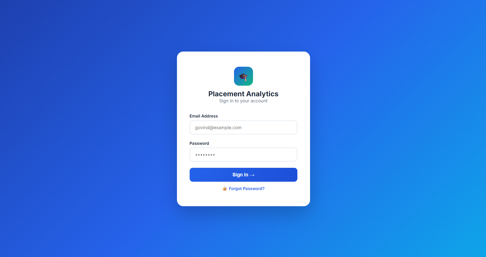

### 👑 Admin Dashboard
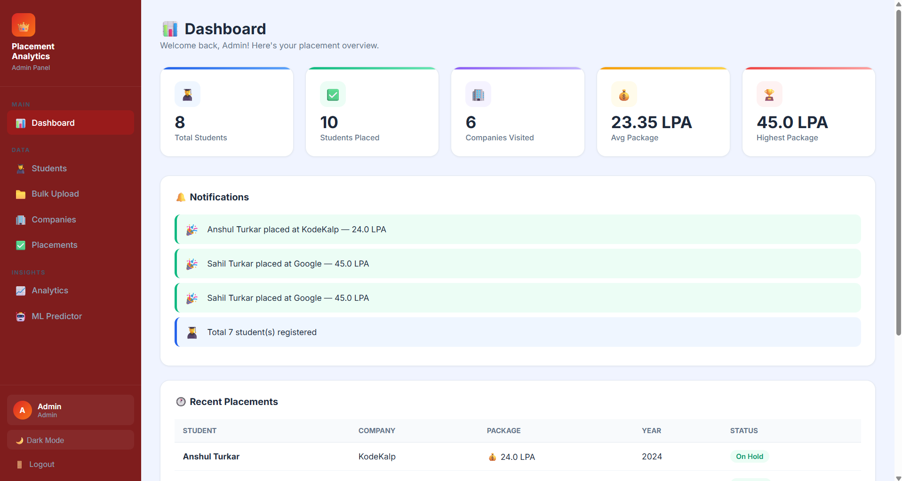

### 🎓 Student Portal
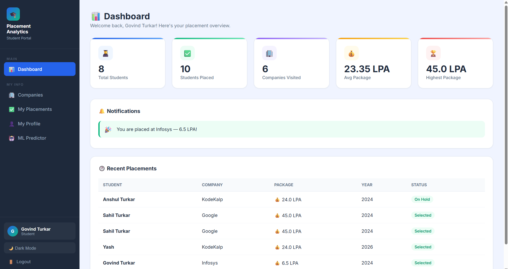

### 📊 Analytics Dashboard
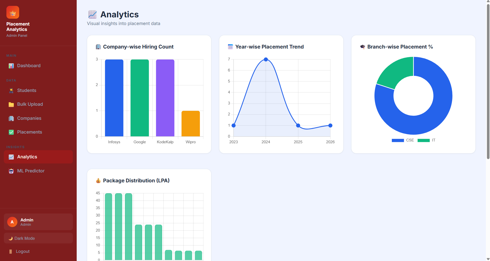

### 🤖 ML Placement Predictor
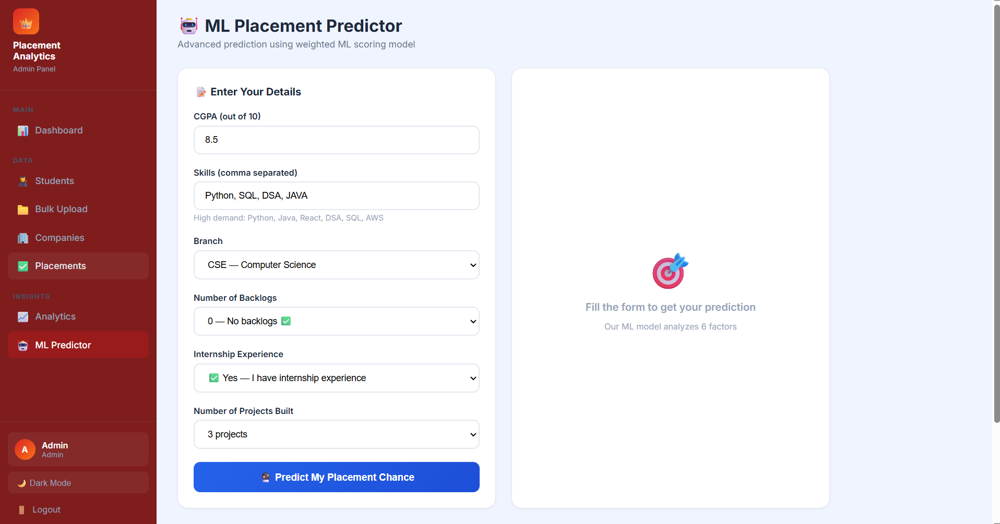

### 📋 ML Predictor Results
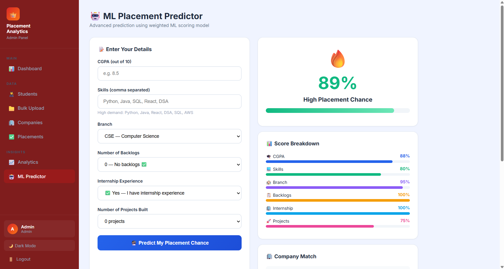

### 👨‍🎓 Students Management
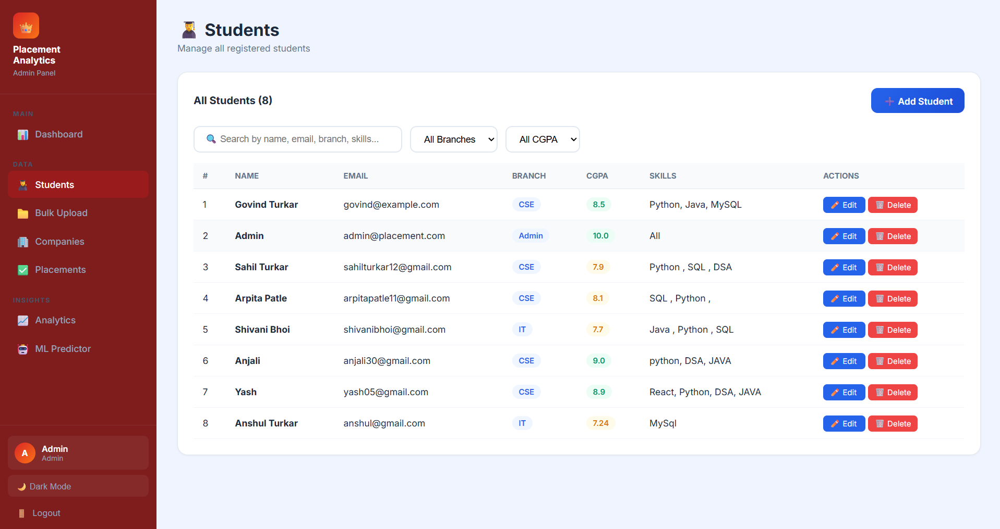

### 🏢 Companies Management
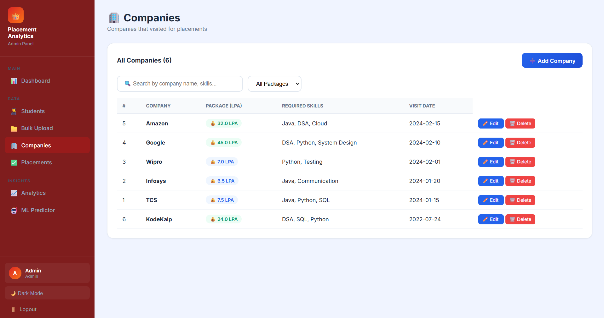

### 👤 Student Profile
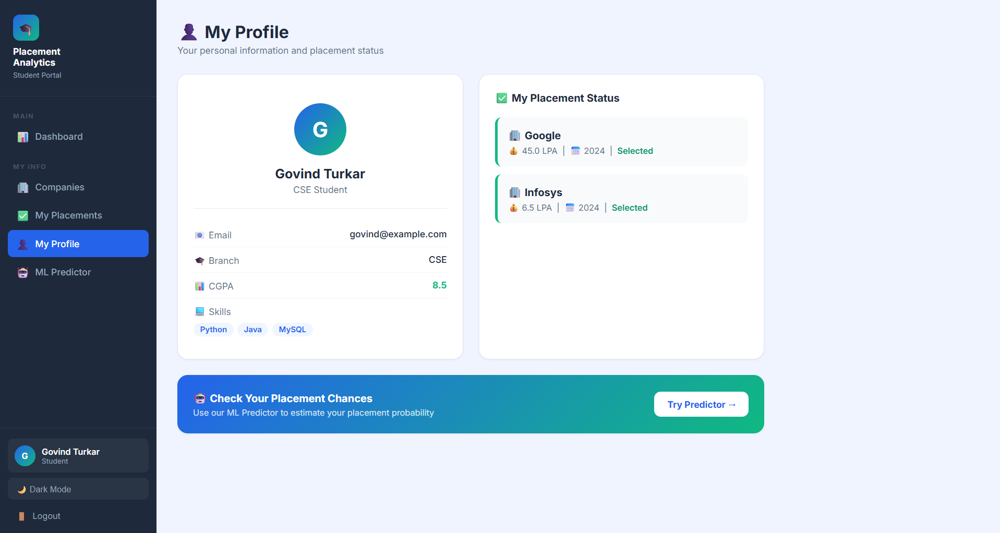

### 📁 CSV Bulk Upload
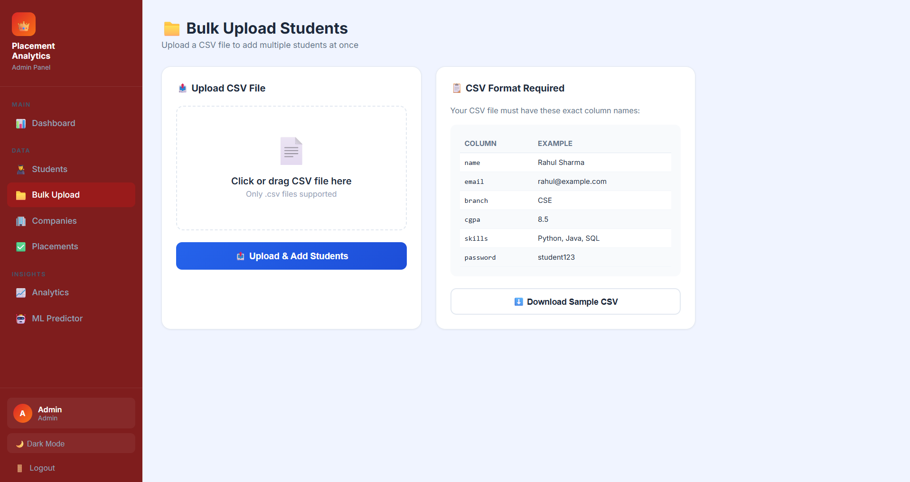

### 🌙 Dark Mode
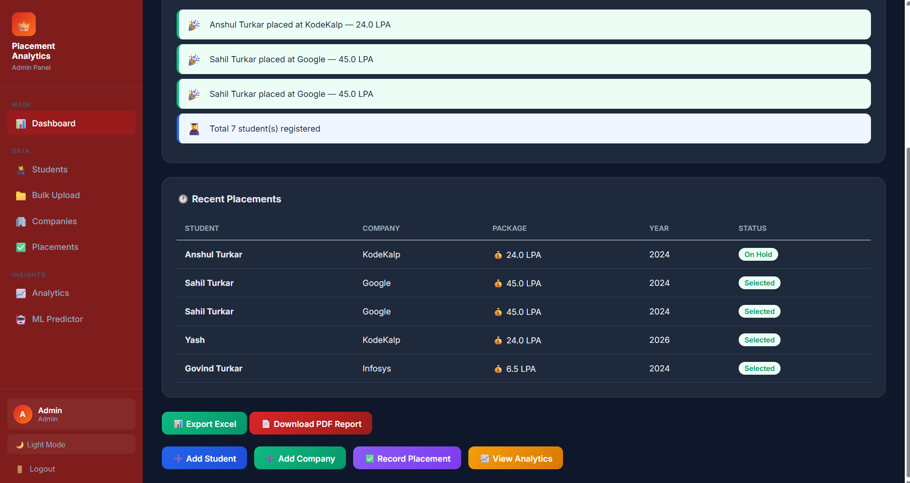

</div>

---

## ✨ Features

<table>
<tr>
<td width="50%">

### 👑 Admin Panel (Red Theme)
- 🔐 Secure hashed password authentication
- 👨‍🎓 Add / Edit / Delete students
- 🏢 Add / Edit / Delete companies
- ✅ Record & manage placements
- 📁 CSV bulk upload (100+ students at once)
- 🔍 Search & filter students and companies
- 📊 Full analytics dashboard (5 chart types)
- 📄 Download PDF placement report
- 📊 Export data to Excel (3 sheets)
- 🔔 Dashboard notifications
- 🤖 ML placement predictor access
- 🌙 Dark mode toggle

</td>
<td width="50%">

### 🎓 Student Portal (Blue Theme)
- 🔐 Personal secure login
- 🏢 Browse visiting companies
- ✅ Track personal placement status
- 👤 Personal profile page with skill badges
- 🤖 ML predictor — check placement chances
- 🔔 Personalized placement notifications
- 🌙 Dark mode toggle
- 🔑 Forgot password via email reset

</td>
</tr>
</table>

---

## 🤖 ML Placement Predictor

Our advanced **6-factor weighted scoring model** predicts placement chances with high accuracy:

| Factor | Weight | Description |
|:---|:---:|:---|
| 🎓 CGPA | **30%** | Academic performance score |
| 💻 Skills | **25%** | Skill count + high-demand skill matching |
| 🏫 Branch | **15%** | Branch-wise placement probability |
| 📋 Backlogs | **15%** | Backlog penalty factor |
| 🏢 Internship | **10%** | Industry experience bonus |
| 🚀 Projects | **5%** | Portfolio & project count |

**Output includes:**
- Overall placement chance percentage
- Visual score breakdown (6 bar charts)
- Company match recommendations (Google, Amazon, TCS etc.)
- Personalized improvement tips

---

## 📈 Analytics Dashboard

| Chart | Insight |
|:---|:---|
| 📊 Bar Chart | Company-wise hiring count |
| 📈 Line Chart | Year-wise placement trend |
| 🍩 Doughnut Chart | Branch-wise placement percentage |
| 📊 Bar Chart | Package distribution by company |
| 📊 Horizontal Bar | Most in-demand skills |

---

## 🔒 Security Features

| Feature | Implementation |
|:---|:---|
| Password Hashing | Werkzeug `generate_password_hash` / `check_password_hash` |
| Credentials Storage | Environment variables — never hardcoded |
| Session Management | Flask sessions with 30-minute timeout |
| Role-based Access | Admin vs Student route protection |
| SQL Injection | Parameterized queries throughout |
| Forgot Password | Secure token-based email reset |

---

## 🛠️ Tech Stack

<div align="center">

| Layer | Technology |
|:---|:---|
| **Backend** | Python · Flask 2.3.3 |
| **Database** | MySQL (hosted on Railway) |
| **Frontend** | HTML5 · CSS3 · Chart.js |
| **Auth & Security** | Werkzeug · Flask-Mail · Secrets |
| **PDF Reports** | ReportLab |
| **Excel Export** | OpenPyXL |
| **Email** | Flask-Mail · Gmail SMTP |
| **Deployment** | Render (App) + Railway (DB) |
| **Version Control** | Git · GitHub |

</div>

---

## 🔐 Demo Credentials

> ⚡ Try the live app — no signup needed!

| Role | Email | Password | Access |
|:---|:---|:---|:---|
| 👑 **Admin** | `admin@placement.com` | `admin123` | Full access |
| 🎓 **Student** | `govind@example.com` | `admin123` | Limited access |

🔗 **[Launch Live App →](https://placement-analytics.onrender.com)**

---

## 📁 Project Structure

```
placement-analytics/
├── app.py                      # Flask backend — all routes & business logic
├── database.sql                # MySQL schema + sample seed data
├── requirements.txt            # Python dependencies
├── README.md
│
├── templates/
│   ├── base.html               # Shared layout (Admin red / Student blue themes)
│   ├── login.html              # Login page with forgot password link
│   ├── dashboard.html          # Main dashboard with notifications
│   ├── students.html           # Students list with search & filter
│   ├── add_student.html        # Add student form
│   ├── edit_student.html       # Edit student form
│   ├── companies.html          # Companies list with search & filter
│   ├── add_company.html        # Add company form
│   ├── edit_company.html       # Edit company form
│   ├── placements.html         # Placement records
│   ├── add_placement.html      # Record placement form
│   ├── analytics.html          # Chart.js analytics dashboard
│   ├── predict.html            # ML predictor UI with score breakdown
│   ├── profile.html            # Student profile page
│   ├── upload_csv.html         # CSV bulk upload with drag & drop
│   ├── forgot_password.html    # Forgot password page
│   └── reset_password.html     # Password reset page
│
├── static/
│   └── css/
│       └── style.css           # Custom styles
│
└── screenshots/                # README screenshots (see below)
    ├── login.png
    ├── admin-dashboard.png
    ├── student-dashboard.png
    ├── analytics.png
    ├── ml-predictor.png
    ├── ml-results.png
    ├── students.png
    ├── companies.png
    ├── profile.png
    ├── csv-upload.png
    └── dark-mode.png
```

---

## 🔗 API Routes

| Route | Method | Access | Description |
|:---|:---:|:---|:---|
| `/login` | GET/POST | Public | Authentication |
| `/logout` | GET | All | End session |
| `/forgot_password` | GET/POST | Public | Request password reset |
| `/reset_password/<token>` | GET/POST | Public | Reset password via token |
| `/dashboard` | GET | Logged in | Overview + notifications |
| `/students` | GET | All | List students + search |
| `/add_student` | GET/POST | Admin | Add new student |
| `/edit_student/<id>` | GET/POST | Admin | Edit student details |
| `/delete_student/<id>` | GET | Admin | Delete student |
| `/upload_csv` | GET/POST | Admin | Bulk upload students |
| `/companies` | GET | All | List companies + search |
| `/add_company` | GET/POST | Admin | Add new company |
| `/edit_company/<id>` | GET/POST | Admin | Edit company details |
| `/delete_company/<id>` | GET | Admin | Delete company |
| `/placements` | GET | All | Placement records |
| `/add_placement` | GET/POST | Admin | Record + email notification |
| `/delete_placement/<id>` | GET | Admin | Delete record |
| `/analytics` | GET | Admin | 5-chart analytics |
| `/predict` | GET/POST | All | ML prediction |
| `/profile` | GET | All | Personal profile |
| `/download_report` | GET | Admin | PDF report download |
| `/export_excel` | GET | Admin | Excel export (3 sheets) |
| `/api/stats` | GET | Logged in | JSON stats summary |

---

## ⚙️ Local Setup

```bash
# 1. Clone the repository
git clone https://github.com/govindturkar69-crypto/Placement-Analytics.git
cd Placement-Analytics

# 2. Install dependencies
pip install -r requirements.txt

# 3. Set up the database
mysql -u root -p < database.sql

# 4. Set environment variables
export MYSQL_HOST=localhost
export MYSQL_USER=root
export MYSQL_PASSWORD=your_password
export MYSQL_DB=placement_db
export MYSQL_PORT=3306
export SECRET_KEY=your_secret_key

# 5. Run
python app.py
```

Visit **http://localhost:5000** 🎉

---

## 🌐 Deployment Architecture

```
User Browser
     │
     ▼
┌─────────────────────┐
│   Render.com        │  ← Flask App (Free tier)
│   Flask + Python    │
│   placement-        │
│   analytics.        │
│   onrender.com      │
└─────────┬───────────┘
          │ MySQL Connection
          ▼
┌─────────────────────┐
│   Railway.app       │  ← MySQL Database (Free tier)
│   MySQL 9.4         │
│   cela.proxy.       │
│   rlwy.net          │
└─────────────────────┘
```

---

## 📦 Requirements

```
flask==2.3.3
flask-mysqldb==1.0.1
PyMySQL==1.1.0
cryptography==41.0.7
Werkzeug==2.3.7
Flask-Mail==0.10.0
reportlab==4.1.0
openpyxl==3.1.2
```

---

## 🎤 Interview Answer

> *"I developed a production-ready Smart Placement Analytics System using Python Flask and MySQL. The system features role-based authentication with separate Admin (red theme) and Student (blue theme) dashboards. Admins can manage students and companies, record placements with automatic email notifications, bulk upload via CSV, and export data as PDF or Excel. Students can track their placement status, view their profile with skill badges, and use the ML predictor. The ML model analyzes 6 weighted factors — CGPA (30%), Skills (25%), Branch (15%), Backlogs (15%), Internship (10%), and Projects (5%) — to predict placement chances and recommend matching companies. Security includes Werkzeug password hashing, environment variable credentials, 30-minute session timeout, and token-based password reset via email. The app is live on Render with Railway MySQL as cloud database."*

---

## 📷 How to Add Screenshots

1. Take screenshots of each page listed below
2. Create a `screenshots/` folder in your project
3. Save each file with the exact filename shown
4. Push to GitHub — README will auto-display them!

### Screenshots needed:

| # | Page to Screenshot | Filename to Save As |
|:---|:---|:---|
| 1 | Login page | `screenshots/login.png` |
| 2 | Admin dashboard (red sidebar) | `screenshots/admin-dashboard.png` |
| 3 | Student dashboard (blue sidebar) | `screenshots/student-dashboard.png` |
| 4 | Analytics page (all 5 charts) | `screenshots/analytics.png` |
| 5 | ML Predictor — empty form | `screenshots/ml-predictor.png` |
| 6 | ML Predictor — with results | `screenshots/ml-results.png` |
| 7 | Students list page | `screenshots/students.png` |
| 8 | Companies list page | `screenshots/companies.png` |
| 9 | Student profile page | `screenshots/profile.png` |
| 10 | CSV Upload page | `screenshots/csv-upload.png` |
| 11 | Any page in Dark Mode | `screenshots/dark-mode.png` |

---

## 👨‍💻 Developer

<div align="center">

**Govind Turkar**

[](https://github.com/govindturkar69-crypto)

</div>

---

<div align="center">

⭐ **Star this repo if you found it helpful!** ⭐

*Built with ❤️ using Flask + MySQL + Chart.js*

</div>
