<div align="center">


# Smart Placement Analytics System

### A full-stack college placement management platform with role-based dashboards, real-time analytics, and an ML-based placement predictor

[](https://placement-analytics.onrender.com)
[](https://github.com/govindturkar69-crypto/Placement-Analytics)


[](https://github.com/govindturkar69-crypto/Placement-Analytics/actions/workflows/tests.yml)

</div>

---

## Screenshots

<div align="center">

### Login
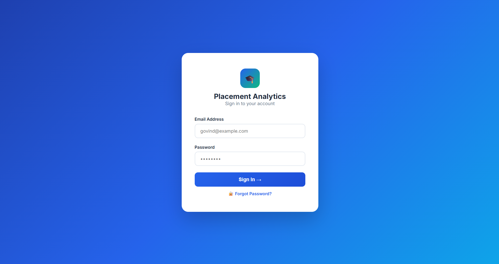

### Admin Dashboard
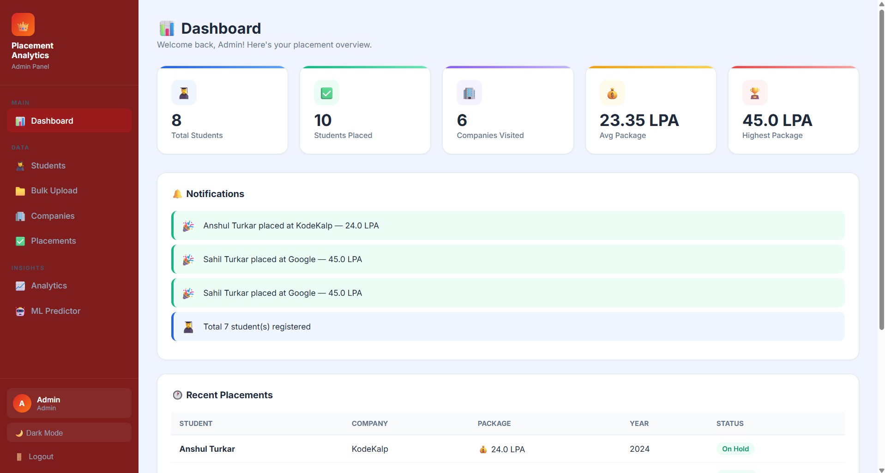

### Student Portal
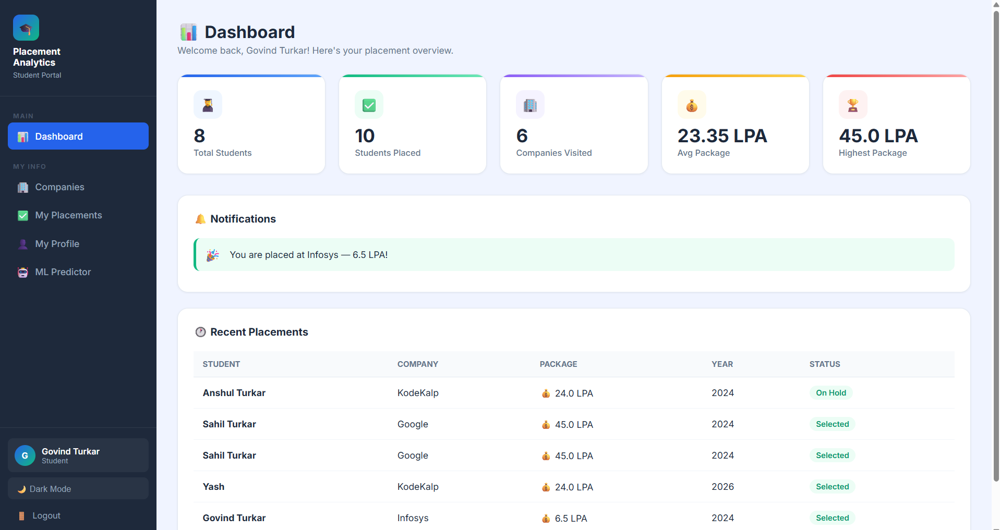

### Analytics Dashboard
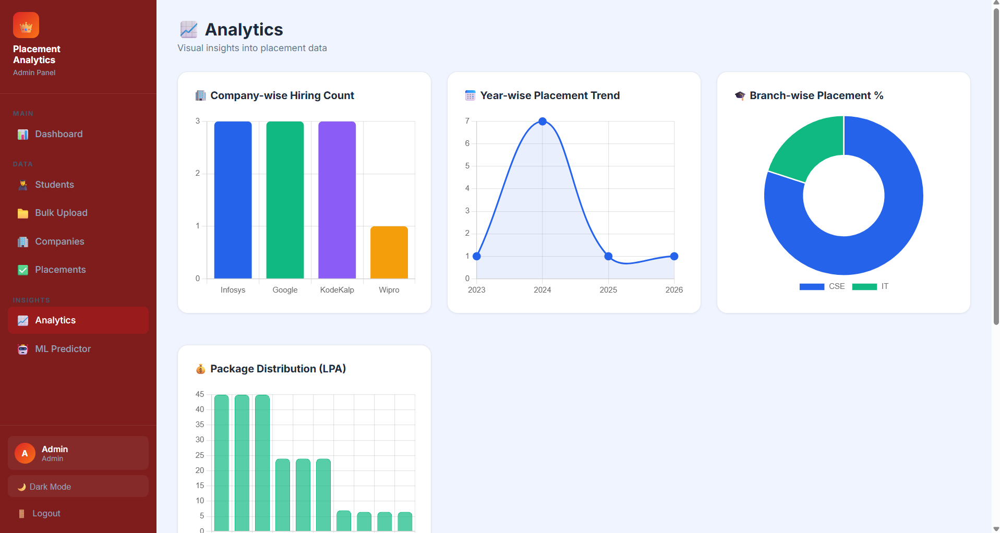

### ML Placement Predictor
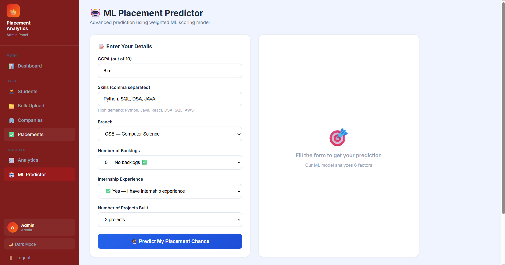

### Predictor Results
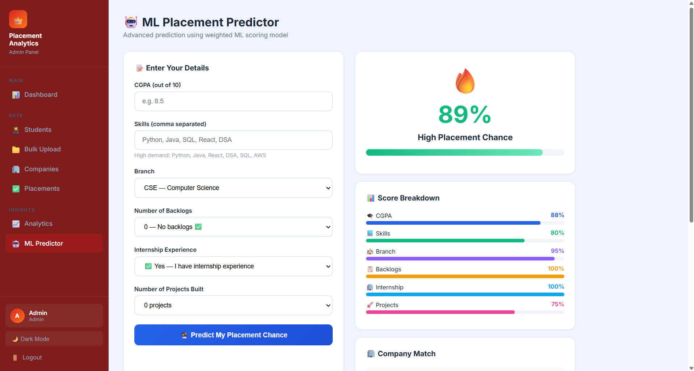

### Student Management
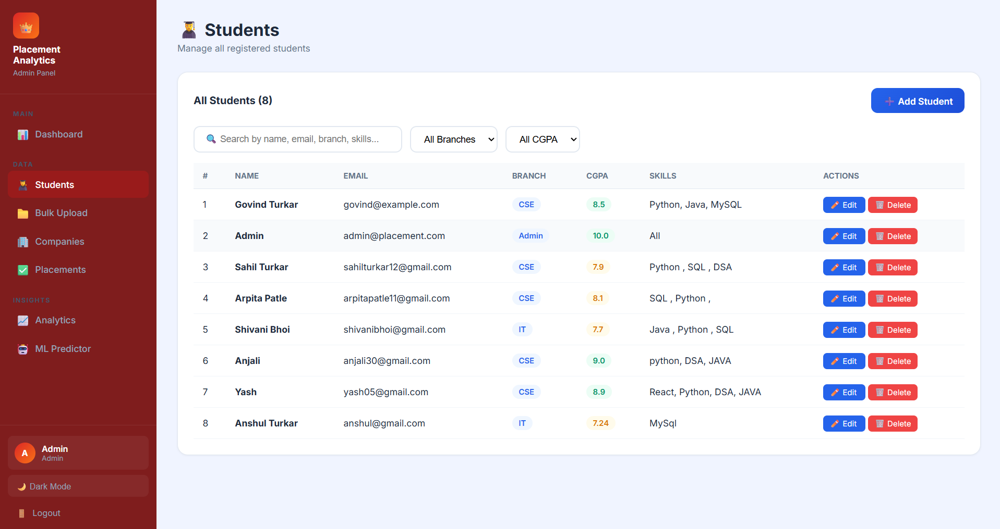

### Company Management
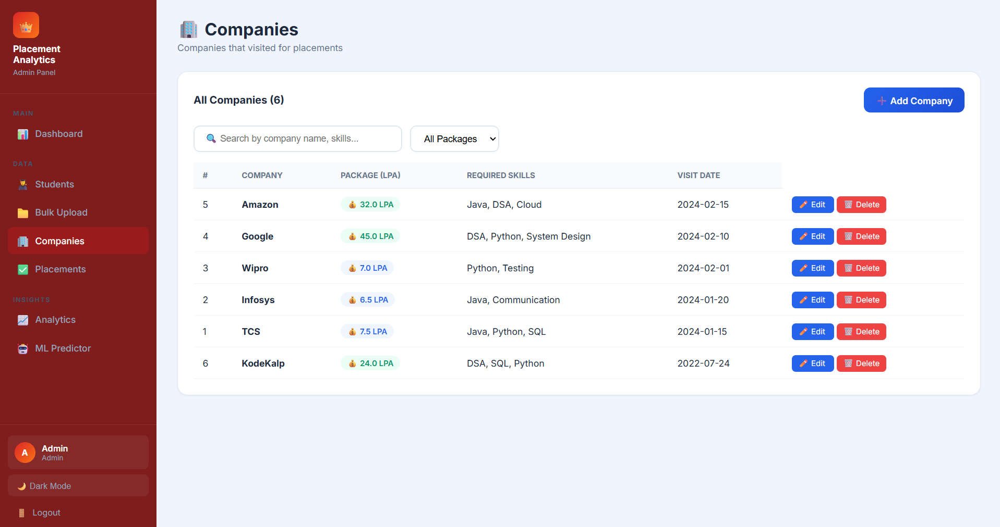

### Student Profile
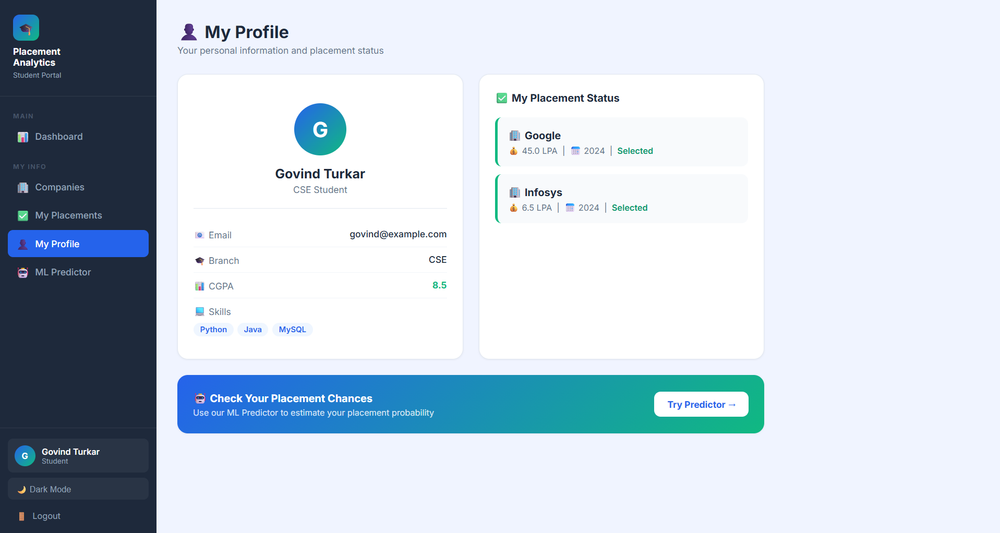

### CSV Bulk Upload
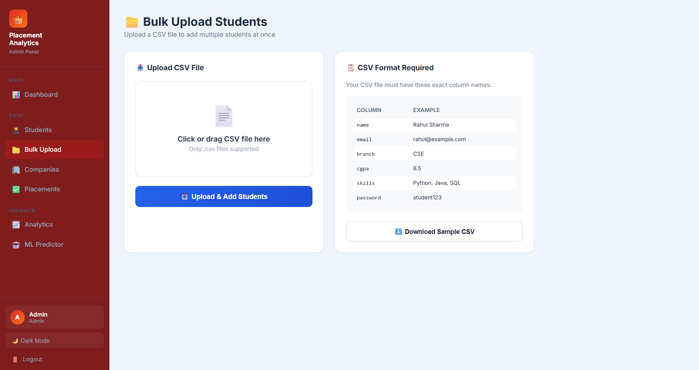

### Dark Mode
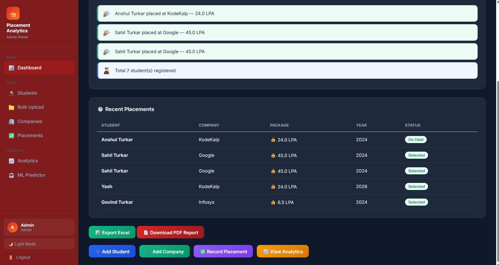

</div>

---

## Features

<table>
<tr>
<td width="50%">

### Admin

- Add, edit, and delete students and companies
- Record and manage placements, with email notification on placement
- CSV bulk upload for students
- Search and filter across students and companies
- Analytics dashboard with five chart types
- PDF report and Excel export (multi-sheet)
- Dashboard notifications
- Dark mode

</td>
<td width="50%">

### Student

- Personal login, separate from the admin view
- Browse visiting companies
- Track personal placement status
- Profile page with skill badges and a readiness score
- ML predictor to estimate placement chances
- Email-based password reset
- Dark mode

</td>
</tr>
</table>

---

## ML Placement Predictor

A weighted six-factor scoring model estimates placement probability:

| Factor | Weight | What it measures |
|:---|:---:|:---|
| CGPA | 30% | Academic performance |
| Skills | 25% | Skill count and match against in-demand skills |
| Branch | 15% | Historical branch-wise placement rate |
| Backlogs | 15% | Backlog penalty |
| Internship | 10% | Prior industry experience |
| Projects | 5% | Project portfolio count |

The result includes an overall chance percentage, a per-factor score breakdown, company-tier matches, and personalized improvement tips.

---

## Analytics Dashboard

| Chart | Shows |
|:---|:---|
| Bar | Company-wise hiring count |
| Line | Year-over-year placement trend |
| Doughnut | Branch-wise placement share |
| Bar | Package distribution by company |
| Horizontal bar | Most in-demand skills |

---

## Security

| Area | Implementation |
|:---|:---|
| Passwords | Hashed with Werkzeug (`pbkdf2:sha256`), never stored or logged in plain text |
| CSRF | Flask-WTF tokens on every state-changing form |
| SQL injection | Parameterized queries throughout — no string-built SQL |
| XSS | Autoescaped templates; chart data passed through Jinja's `tojson`, not raw JSON |
| Session handling | HttpOnly, Secure, SameSite=Lax cookies; 30-minute idle timeout |
| Access control | Route-level admin/student separation on every view and mutation |
| Rate limiting | Login and password-reset requests are throttled per IP |
| File uploads | Size-capped; CSV export sanitized against formula injection |
| Transport | HSTS enabled; security headers (`X-Content-Type-Options`, `X-Frame-Options`, `Referrer-Policy`) on every response |
| Credentials | Configured entirely through environment variables, never hardcoded |

---

## Tech Stack

<div align="center">

| Layer | Technology |
|:---|:---|
| Backend | Python, Flask |
| Database | MySQL |
| Frontend | HTML5, CSS3, Chart.js |
| Auth & security | Werkzeug, Flask-WTF, Flask-Limiter |
| PDF reports | ReportLab |
| Excel export | OpenPyXL |
| Email | Flask-Mail (SMTP) |
| Testing | `unittest`, GitHub Actions CI |
| Deployment | Render |

</div>

---

## Try It Yourself

Clone the repo and follow [Local Setup](#local-setup) below to run the app against your own database with your own credentials. Live demo credentials aren't published here — publishing a working admin login for a real deployment is a standing invitation to anyone reading this file.

---

## Project Structure

```
placement-analytics/
├── app.py                       # Flask app: routes, auth, business logic
├── database.sql                 # Schema + sample seed data
├── requirements.txt
├── README.md
│
├── templates/
│   ├── base.html                 # Shared layout for authenticated pages
│   ├── auth_base.html            # Shared layout for login/forgot/reset
│   ├── login.html
│   ├── forgot_password.html
│   ├── reset_password.html
│   ├── dashboard.html
│   ├── students.html / add_student.html / edit_student.html
│   ├── companies.html / add_company.html / edit_company.html
│   ├── placements.html / add_placement.html
│   ├── analytics.html
│   ├── predict.html
│   ├── profile.html
│   ├── upload_csv.html
│   ├── 404.html / 500.html
│
├── scripts/
│   └── init_passwords.py        # One-time helper: hash seed-data passwords
│
├── tests/                        # unittest suite (mocked DB, no live DB needed)
│
├── .github/workflows/
│   └── tests.yml                 # CI: runs the test suite on push/PR
│
└── screenshots/                  # Images referenced above
```

---

## API Routes

| Route | Method | Access | Description |
|:---|:---:|:---|:---|
| `/` | GET | Public | Redirects to login or dashboard |
| `/login` | GET/POST | Public | Authentication |
| `/logout` | GET | Any | End session |
| `/forgot_password` | GET/POST | Public | Request a password reset link |
| `/reset_password/<token>` | GET/POST | Public | Reset password via emailed token |
| `/dashboard` | GET | Logged in | Overview and notifications |
| `/students` | GET | Logged in | List students |
| `/add_student` | GET/POST | Admin | Add a student |
| `/edit_student/<id>` | GET/POST | Admin | Edit a student |
| `/delete_student/<id>` | POST | Admin | Delete a student |
| `/upload_csv` | GET/POST | Admin | Bulk-add students from CSV |
| `/companies` | GET | Logged in | List companies |
| `/add_company` | GET/POST | Admin | Add a company |
| `/edit_company/<id>` | GET/POST | Admin | Edit a company |
| `/delete_company/<id>` | POST | Admin | Delete a company |
| `/placements` | GET | Logged in | Placement records |
| `/add_placement` | GET/POST | Admin | Record a placement (sends email) |
| `/delete_placement/<id>` | POST | Admin | Delete a placement record |
| `/analytics` | GET | Admin | Chart dashboard |
| `/predict` | GET/POST | Logged in | ML placement prediction |
| `/profile` | GET | Logged in | Personal profile |
| `/download_report` | GET | Admin | PDF report download |
| `/export_excel` | GET | Admin | Excel export |
| `/api/stats` | GET | Logged in | JSON summary stats |

---

## Local Setup

```bash
# 1. Clone the repository
git clone https://github.com/govindturkar69-crypto/Placement-Analytics.git
cd Placement-Analytics

# 2. Install dependencies
pip install -r requirements.txt

# 3. Set up the database
mysql -u root -p < database.sql

# 4. Hash the sample seed passwords (database.sql stores them as plain
#    text; this converts them to Werkzeug hashes before first login)
python scripts/init_passwords.py

# 5. Configure environment variables — create a .env file in the
#    project root (auto-loaded by python-dotenv, no manual export needed):
cat > .env <<EOF
MYSQL_HOST=localhost
MYSQL_USER=root
MYSQL_PASSWORD=your_password
MYSQL_DB=placement_db
MYSQL_PORT=3306
SECRET_KEY=your_secret_key
EOF

# 6. Run
python app.py
```

Visit **http://localhost:5000**.

### Running tests

```bash
python -m unittest discover -s tests -v
```

The suite mocks the database layer, so it runs without a live MySQL connection. CI runs it automatically on every push and pull request to `main`.

---

## Deployment

```
Browser
   │
   ▼
Render (Flask app)
   │
   ▼
Managed MySQL
```

The app reads all database and mail credentials from environment variables at startup — nothing is hardcoded, and none of it lives in this repository.

---

## Developer

<div align="center">

**Govind Turkar**

[](https://github.com/govindturkar69-crypto)

</div>
