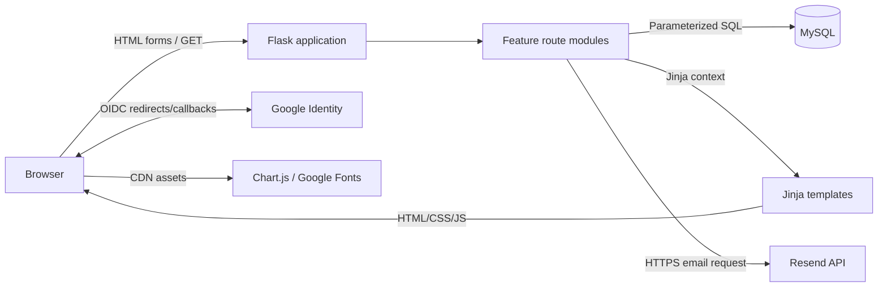
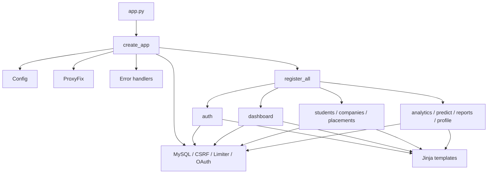
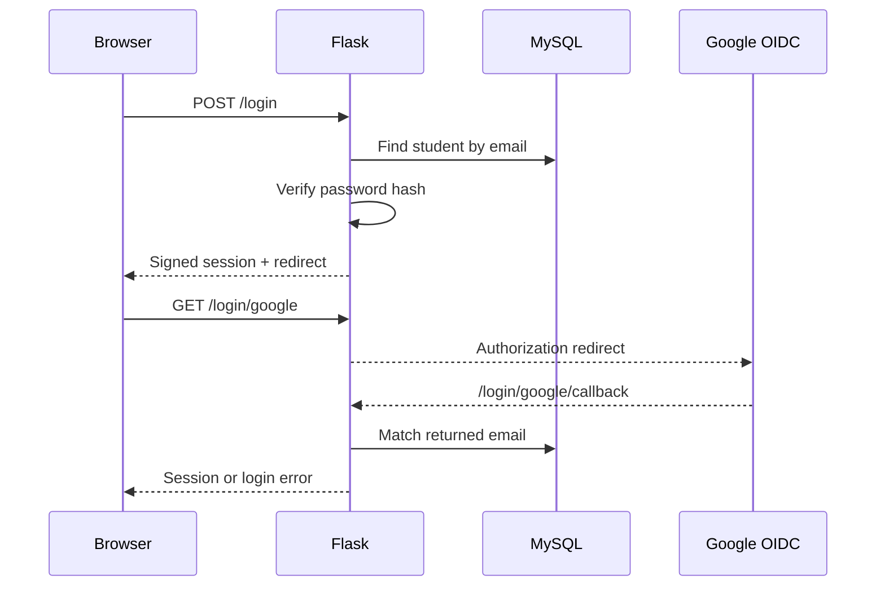

# System Architecture

## Overview and pattern

The project is a modular server-rendered monolith. A Flask application factory composes shared extensions and route-registration modules. Routes perform validation, direct SQL, response shaping, and template rendering; there is no separate service, repository, ORM, SPA, or background-worker layer.

## Repository structure

| Path | Role |
| --- | --- |
| `app.py` | Executable entry point; constructs `app` and preserves test/script imports |
| `placement_analytics/__init__.py` | Factory, middleware, extension initialization, route registration, response policy |
| `placement_analytics/config.py` | Environment-to-configuration mapping |
| `placement_analytics/extensions.py` | Per-context MySQL wrapper and Flask extension instances |
| `placement_analytics/decorators.py` | Login/admin guards |
| `placement_analytics/errors.py` | Application error handlers |
| `placement_analytics/utils.py` | Same-origin redirects, blank checks, Excel safety |
| `placement_analytics/email.py` | Best-effort Resend client |
| `placement_analytics/routes/` | Auth, dashboard, students, companies, placements, analytics, predictor, reports, profile |
| `placement_analytics/templates/` | Authenticated shell, auth shell, feature pages, public/error pages |
| `database.sql` | Schema and seeds |
| `tests/` | Mocked route/helper unit tests |

The route files are “blueprint-style” in organization but do not instantiate Flask Blueprints. Each exports `register(app)`.

## Composition and dependencies

## Request lifecycle

1. Reverse-proxy metadata is normalized by `ProxyFix`.
2. Flask matches a route; Flask-Limiter and global CSRF protection apply where relevant.
3. A decorator reloads the current account role/password version, invalidates stale sessions, and may redirect anonymous or non-admin users.
4. The route validates form/query/session data, obtains the context-scoped MySQL connection, and runs parameterized SQL.
5. Mutations commit explicitly; selected integrity failures roll back.
6. The route returns HTML, redirect, JSON, text/XML, PDF, or XLSX. Email requests are synchronous but best-effort.
7. `after_request` adds security/cache headers and may gzip the body.
8. Flask teardown closes the context connection.

## Authentication flows

Google registration uses a second callback. Existing emails are signed in; new identity fields are stored temporarily in the session until `/register/google/complete` supplies branch/CGPA/skills.

Password reset creates a hashed OTP in `password_otps`, emails the plaintext code, tracks cooldown/resends in the session, deletes the OTP on successful verification, and permits password replacement for 10 minutes.

## Data and feature flows

- Dashboard and analytics read aggregates and joined placement rows.
- Admin CRUD writes `students`, `companies`, and `placements` directly.
- CSV import decodes UTF-8, requires six headers, applies the same email/password/CGPA rules as individual creation, hashes each password, skips failing rows, and commits the batch.
- Predictor does not access the database; it scores request fields using hard-coded thresholds and weights.
- PDF/XLSX generation reads current joined data into memory and returns an attachment.
- `/api/stats` returns aggregate counts/rates as JSON.

## Important architectural constraints

MySQL is the only persistent state. Sessions are client-side signed cookies; rate-limit counters are in process memory. Resend and Google are optional integrations. Deployment topology beyond a single proxied Flask process is unknown / not determinable from repository.
