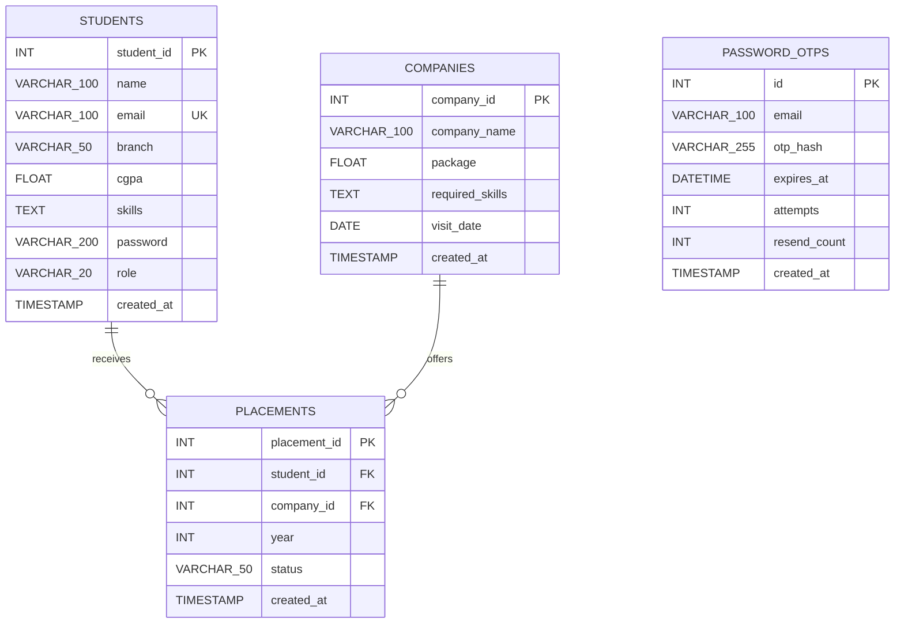

# Database Documentation

## Technology and source of truth

The application uses MySQL through PyMySQL with direct parameterized SQL. `database.sql` is the only schema definition and also inserts sample records. No ORM, migration directory, schema-version table, or automated migration process exists.

## Entity relationship diagram

`password_otps.email` has no declared foreign key to `students.email`.

## Complete declared schema

### `students`

| Column | Type | Null/default | Constraints/use |
| --- | --- | --- | --- |
| `student_id` | `INT` | not null | auto-increment primary key |
| `name` | `VARCHAR(100)` | not null | display/profile/report value |
| `email` | `VARCHAR(100)` | not null | unique login/OIDC/reset identity |
| `branch` | `VARCHAR(50)` | not null | profile and analytics grouping |
| `cgpa` | `FLOAT` | not null | profile/predictor input |
| `skills` | `TEXT` | nullable | comma-separated free text |
| `password` | `VARCHAR(200)` | not null | Werkzeug hash or unusable `google:` token |
| `role` | `VARCHAR(20)` | not null, `student` | application recognizes `admin` and `student` |
| `created_at` | `TIMESTAMP` | current timestamp | creation metadata; not exposed by routes |

### `companies`

| Column | Type | Null/default | Constraints/use |
| --- | --- | --- | --- |
| `company_id` | `INT` | not null | auto-increment primary key |
| `company_name` | `VARCHAR(100)` | not null | lists, analytics, reports |
| `package` | `FLOAT` | not null | interpreted/displayed as LPA |
| `required_skills` | `TEXT` | nullable | comma-separated analytics input |
| `visit_date` | `DATE` | nullable | company ordering/display |
| `created_at` | `TIMESTAMP` | current timestamp | creation metadata |

### `placements`

| Column | Type | Null/default | Constraints/use |
| --- | --- | --- | --- |
| `placement_id` | `INT` | not null | auto-increment primary key |
| `student_id` | `INT` | not null | FK to `students.student_id`, `ON DELETE CASCADE` |
| `company_id` | `INT` | not null | FK to `companies.company_id`, `ON DELETE CASCADE` |
| `year` | `INT` | not null | sorting/year analytics |
| `status` | `VARCHAR(50)` | `Selected` | free status text from fixed UI choices |
| `created_at` | `TIMESTAMP` | current timestamp | creation metadata |

There is no uniqueness constraint preventing duplicate placements.

### `password_otps`

| Column | Type | Null/default | Constraints/use |
| --- | --- | --- | --- |
| `id` | `INT` | not null | auto-increment primary key |
| `email` | `VARCHAR(100)` | not null | reset lookup identity |
| `otp_hash` | `VARCHAR(255)` | not null | Werkzeug-hashed OTP |
| `expires_at` | `DATETIME` | not null | 10-minute expiry enforced in application |
| `attempts` | `INT` | `0`, not null | maximum five enforced in application |
| `resend_count` | `INT` | `0`, not null | declared but current route tracks resends in session instead |
| `created_at` | `TIMESTAMP` | current timestamp | latest-code ordering |

## Indexes and relationships

Declared indexes are the four primary keys, the unique index implied by `students.email`, foreign-key-supporting indexes MySQL creates/needs for placement references, and `idx_password_otps_email`. Exact implicit index names are unknown / not determinable from the SQL file.

The schema says deleting a student or company cascades related placements. Route code also catches integrity errors and displays “delete placements first,” which would apply only if the deployed constraint differs from this file. This is a repository-level inconsistency; production schema was not inspected.

## Data lifecycle and important queries

- Registration/admin/CSV create students; passwords are hashed before normal application inserts.
- Company and placement admin forms create/update/delete corresponding rows.
- Placement creation reads the related student/company after commit for notification content.
- Dashboards, analytics, reports, and stats use counts, averages, maxima, grouping, and joins.
- OTP issuance removes expired rows globally and previous rows for the email, then inserts one active hash. Verification locks the selected row before incrementing attempts or consuming a successful code. Password reset deletes all rows for the email.
- No archival, retention, soft delete, backup, transaction retry, or audit mechanism is defined.

## Seeds and migrations

`database.sql` creates database `placement_db` and inserts seven sample companies. It does not seed users, passwords, administrators, or placements. After registering the initial user, an operator must promote that account to `admin` directly in MySQL.

There are no migrations. Re-running the SQL is not idempotent for seed inserts even though table creation uses `IF NOT EXISTS`.

## Validation boundaries

Database constraints enforce required values, unique email, and placement referential integrity. Registration, admin student forms, and CSV imports validate email syntax, password policy where applicable, and finite CGPA values from 0–10. The database itself does not constrain CGPA range, role/status vocabulary, placement year, positive package, skill format, or OTP linkage.
